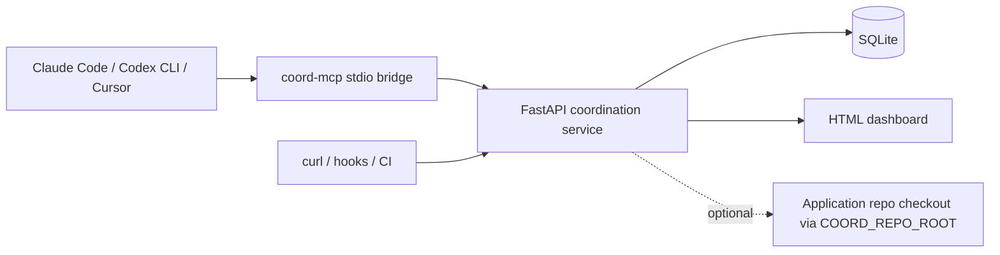
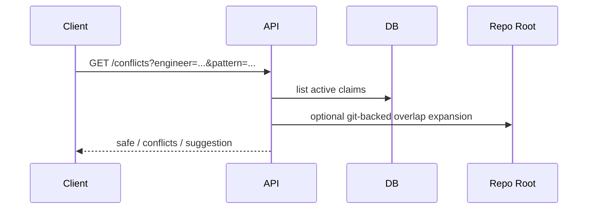
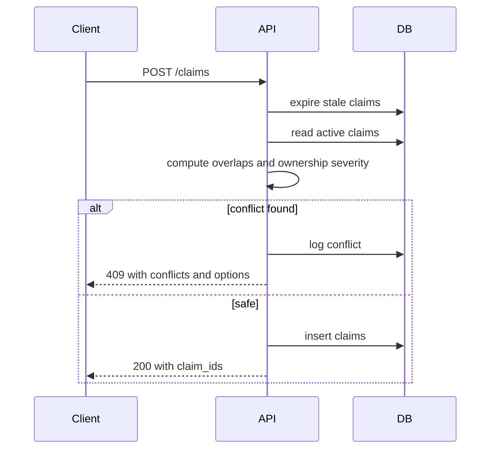
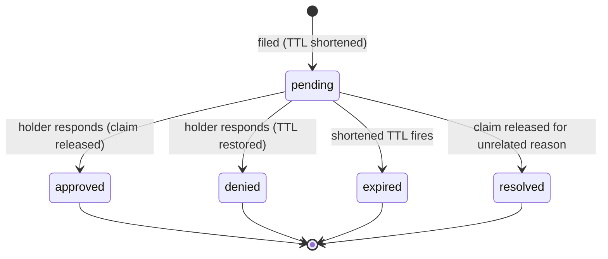

# Architecture

## High-level model

The coordination service sits beside your application repo and acts as a shared control plane for agent work.

## Components

### FastAPI app

The ASGI app object is `coordination.main:app`. In the shipped container it is launched by `coord-api` (a thin wrapper around `uvicorn coordination.main:app`); you can also point any ASGI server at the same import path if you are running outside the image.

The API handles:

- claim creation and release
- conflict checks
- ownership config upload and retrieval
- readiness/metadata endpoints
- dashboard rendering

### SQLite database

SQLite stores:

- active and historical claims (with `repo`, `session_id`, `last_activity` columns added in v0.3-v0.6)
- conflict log entries (with `attempted_session_id` added in v0.6)
- release requests and their immutable audit-event timeline (v0.9)
- ownership YAML
- forwards-only schema migration history in the `schema_version` table

The schema has reached v6 as of coord v0.11.0. Migrations run inside a `BEGIN IMMEDIATE` transaction at process startup so concurrent processes serialise on the write lock instead of racing.

The v6 columns (`requests.requested_scope` and `claims.coexists_with`, both nullable) underpin the v0.11 `narrowed` and `coexist` decision verbs. `coexists_with` stores a JSON array of partner claim ids; the conflict check excludes any candidate claim that's referenced by one of the caller's session's claims (so a coexist pair sees each other as cooperative, not adversarial).

Schema v8 (v0.14) adds two columns on `claims` -- `scope_type TEXT NOT NULL DEFAULT 'file'` and `narrowable BOOLEAN NOT NULL DEFAULT 1` -- plus a `claim_symbols` join table (`claim_id`, `file_path`, `symbol_name`, `symbol_kind`) for per-claim symbol enumeration. `scope_type='file'` is the legacy whole-file claim; `scope_type='symbol'` covers only the named declarations and leaves imports / module-level statements uncovered. The conflict pipeline gains a post-filter on path-intersection results: two symbol-scope claims with disjoint symbol sets resolve as `AUTO_COEXIST` (both granted, no request filed, audit event `auto-coexist`), and a symbol-scope requester arriving against an existing narrowable file claim resolves as `AUTO_NARROW` (both granted, holder gets a `pending_requests` notice, audit event `auto-narrow`). Both decisions bypass the `requests` table because the resolution is mechanical and free of policy ambiguity. v0.19 extends the TypeScript parser to walk recursively into nested class declarations so `Outer::Inner::method` symbol claims validate end-to-end for TS as well as Python; Go's receiver-as-parent extraction (v0.16) remains the deepest nesting that applies because Go has no nested class model. v0.20 adds hotspot detection: a read-only signal computed from `conflict_log` and exposed at `GET /metrics/hotspots` and on the dashboard panel (auto-promote queued for v0.21). See [./design/sub-file-claims.md](./design/sub-file-claims.md) for the full spec, parser strategy, and migration notes.

WAL mode is enabled so reads and writes behave better under normal team concurrency.

At startup the service takes an advisory `fcntl.flock` on `<database_path>.lock`, a sibling file in the same directory as the SQLite database. The lock is held for the process lifetime and auto-releases on exit, so a second coord process pointed at the same DB refuses to start with a clear error rather than silently racing on in-process caches. Set `COORD_DISABLE_INSTANCE_LOCK=true` to bypass (NFS-backed volumes, debugging). Note: flock is advisory and depends on the underlying filesystem honouring it. Native Linux kernels (production containers) enforce it across processes and containers; Docker Desktop on Mac and Windows does not propagate flock across containers sharing a host bind mount, so dev-time on those hosts should rely on orchestrator-level single-replica constraints instead.

### MCP bridge

The MCP server runs as a stdio process with `coord-mcp`. It proxies tool calls to the HTTP API using `COORD_API_URL` and `COORD_AUTH_TOKEN`.

This is the intended integration path for Claude Code, Codex CLI, and Cursor. You usually do not expose a separate remote MCP endpoint.

#### Env resolution

The wrapper reconciles two configuration sources at startup so committed MCP registrations can ship placeholder env values without breaking working setups:

1. **Explicit env** from the MCP child process: shell exports, the `env` block inside `.mcp.json`, or the `[mcp_servers.coord.env]` block in Codex's config.
2. **`<repo-root>/.coordination/local.env`**, auto-loaded by walking up from cwd until a match is found, restricted to a `COORD_*` allowlist.

For each allowlisted variable: if the current value is unset or matches a documented placeholder (`set-me`, `example-org/example-repo`, `http://127.0.0.1:8080`), the wrapper overrides from `local.env`; otherwise the explicit value wins. The `Authorization` header is suppressed entirely when the resolved token is a placeholder, so the failure mode is a clean `401 Authorization required` rather than the server logging a forged-looking `Bearer set-me` line. The committed `.mcp.json` template can therefore live in a public repo carrying only the placeholders, with the real bearer token kept in the gitignored `.coordination/local.env`.

### Templates

The `templates/` directory is the rollout kit for the application repo:

- MCP configs
- agent-rule snippets
- ownership YAML example
- pre-push hook
- CI/merge queue notes

## Request flow

### Conflict check

### Claim creation

### Release requests (v0.9.0+)

A requester whose `claim_files` was blocked can file a first-class request asking the holder to release. Filing shortens the holder's claim TTL and creates a tracked record in the `requests` table:

Every transition writes one row to the append-only `request_events` table with actor, session_id, timestamp, and a JSON detail blob. Operators can replay the full lifecycle of any request via `GET /requests/{id}/events`. Event types: `filed`, `notified` (first observation per holder session), `responded`, `expired`, `resolved`, plus `responded-late` when a holder tries to decide after the request has terminalised.

The long-poll on `POST /requests` is implemented as a 1s DB poll loop on the request row. This works regardless of how many replicas you run; the responder's transaction lands in WAL and the poller's next read picks it up.

v0.21 adds a separate FIFO `claim_queue` state machine for `claim_files` callers who pass `wait_seconds > 0`: enqueued behind the blocking holder, drained on any release path, auto-granted in arrival order. v0.22 surfaces those queue rows live via `GET /requests?queued=true` (joined with the blocking holder's engineer + pattern) and via a per-repo "pending queue" dashboard panel showing depth and head-of-queue waiter. v0.24 makes the queue cross-process-safe: the long-poll arms the same-process `asyncio.Event` for instant local wake-ups and additionally polls the queue's DB row every ~0.5s, so a release that lands on a different replica still wakes the waiter within the poll interval rather than sitting until the `wait_seconds` deadline. v0.25 adds priority-aware dequeue: schema v12 adds `claim_queue.priority` (`low | normal | high | blocking`, default `normal`) and the next-waiter lookup orders by priority DESC then position ASC so urgent work jumps ahead of normal traffic within the same blocking-claim scope.

## Auth model

- Preferred mode: bearer-token protected API using `COORD_AUTH_TOKEN`
- Optional local/demo mode: `COORD_ALLOW_INSECURE_NO_AUTH=true`

The system does not currently implement a full identity provider or per-user ACL model. The `engineer` field is a client-supplied identifier used for coordination and release ownership.

## Accuracy model

Overlap detection works in two modes:

- repo-aware mode: uses `git ls-files` from `COORD_REPO_ROOT` to enumerate real tracked files, then checks which ones match each pattern via `pathspec` (gitignore semantics). This is the most accurate mode and is preferred when you want the returned overlap list to contain real paths.
- heuristic mode: used when `COORD_REPO_ROOT` is unset or does not point at a git checkout. Each pattern is reduced to exactly one synthetic concrete path that the pattern provably matches, by substituting every wildcard token with a deterministic literal. `**` segments become unique single-directory probes (`ds0`, `ds1`, ...), `*` segments become `x`, `?` becomes `a`, and `[...]` character classes are parsed and replaced with a literal member of the class (for negated classes like `[!.]`, a character guaranteed to be outside the excluded set). The patterns overlap iff either synthetic path is also matched by the peer's `PathSpec`. Because pathspec natively understands that `**` matches zero or more directories, a single probe per side is sufficient at arbitrary depth; there is no combinatorial depth cap and no exponential candidate blowup.

Examples the heuristic handles correctly without a repo checkout:

- `src/**` overlaps `src/auth/login.ts`: the synthetic path from `src/**` is matched by the literal-peer path via the native `**` semantics.
- `src/auth_v2/**` does not overlap `src/auth/**`: path-segment boundaries are preserved so `src/auth` is not treated as a prefix of `src/auth_v2`.
- `src/auth/*` matches `src/auth/login.ts` but not `src/auth/deep/file.ts`: single-star produces one synthetic segment, so the nested path is correctly excluded.
- `a/**/b/**/c/**/deep.ts` overlaps `a/x/b/y/c/z/deep.ts` but not `a/x/b/y/deep.ts`: arbitrary numbers of `**` segments are handled without a depth cap.
- `src/[ab]/*.ts` overlaps `src/a/foo.ts` but not `src/c/foo.ts`; `src/[a-c]/file.ts` covers `src/b/file.ts`; `src/[!.]/file.ts` covers `src/a/file.ts` but not `src/.hidden/file.ts`: character classes, ranges, and negated classes all behave as gitignore specifies.

Negation patterns (leading `!`) are explicitly rejected by both `heuristic_overlap` and `compute_overlap` with a `ValueError`. Gitignore negations mean "exclude these paths" and have no defensible overlap interpretation; rejecting at the boundary is clearer than silently returning surprising results. Callers supplying user-supplied claim patterns should either validate up front or let the engine raise.

Repo-aware mode remains preferred when callers want real file paths in the overlap response. The heuristic returns the sentinel `<unknown>` in the overlap list to signal "overlap detected without a repo-backed file list available".

Pattern matching is **case-sensitive** in both modes, regardless of whether the underlying filesystem is case-sensitive. Git itself treats paths as case-sensitive (APFS on macOS and NTFS on Windows are typically case-insensitive, but git records the case you committed), and this service follows gitignore semantics, which are also case-sensitive. A claim on `src/Auth/**` will not overlap a peer claim on `src/auth/**` even if both resolve to the same directory on a case-insensitive volume. Keep casing consistent with whatever you actually committed.

## Scaling notes

This design is meant for small and medium teams coordinating work on one repo or a small set of repos.

Good fit:

- one team or org-level shared service
- dozens of active claims
- short-lived TTL-based coordination

Less ideal:

- globally distributed locking
- strict transactional guarantees across many concurrent writers
- cross-region HA requirements

If you outgrow SQLite or need stronger guarantees, keep the HTTP and MCP contracts and replace the storage layer first.
